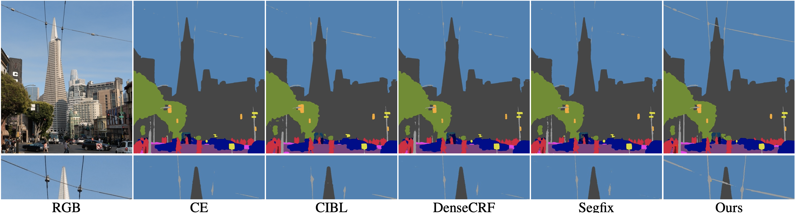

# active-boundary-loss

-------------


By Chi Wang, Yunke Zhang, Miaomiao Cui, Peiran Ren, Yin Yang, Xuansong Xie, Xian-Sheng Hua, Hujun Bao and Weiwei Xu.

This repo is the official implementation of `Active Boundary Loss for Semantic Segmentation` ([Paper link](https://ojs.aaai.org/index.php/AAAI/article/view/20139); arXiv:[2102.02696](https://arxiv.org/abs/2102.02696)) accepted by AAAI 2022 (Oral).

## Dependencies

- Python libarary:
  - pytorch>=1.0
  - torchvision
  - numpy
  - scipy
  - opencv-python
- [label smooth](https://github.com/CoinCheung/pytorch-loss/blob/af876e43218694dc8599cc4711d9a5c5e043b1b2/label_smooth.py)
- [option] [Lovász-Softmax loss](https://github.com/bermanmaxim/LovaszSoftmax)

## How to use

- Directly use ABL in `abl.py`.
- For ease of use, we provide an all-in-one version. In addition, you can speed it up by moving the process of distance map generation to the dataloader.

## Citation

```
@inproceedings{wang2022active,
  title={Active boundary loss for semantic segmentation},
  author={Wang, Chi and Zhang, Yunke and Cui, Miaomiao and Ren, Peiran and Yang, Yin and Xie, Xuansong and Hua, Xian-Sheng and Bao, Hujun and Xu, Weiwei},
  booktitle={Proceedings of the AAAI Conference on Artificial Intelligence},
  volume={36},
  number={2},
  pages={2397--2405},
  year={2022}
}
```

## Contact

If you have any questions, please feel free to contact `wangchi1995@zju.edu.cn`.
